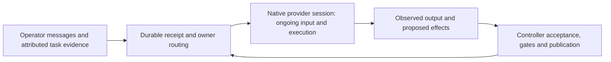
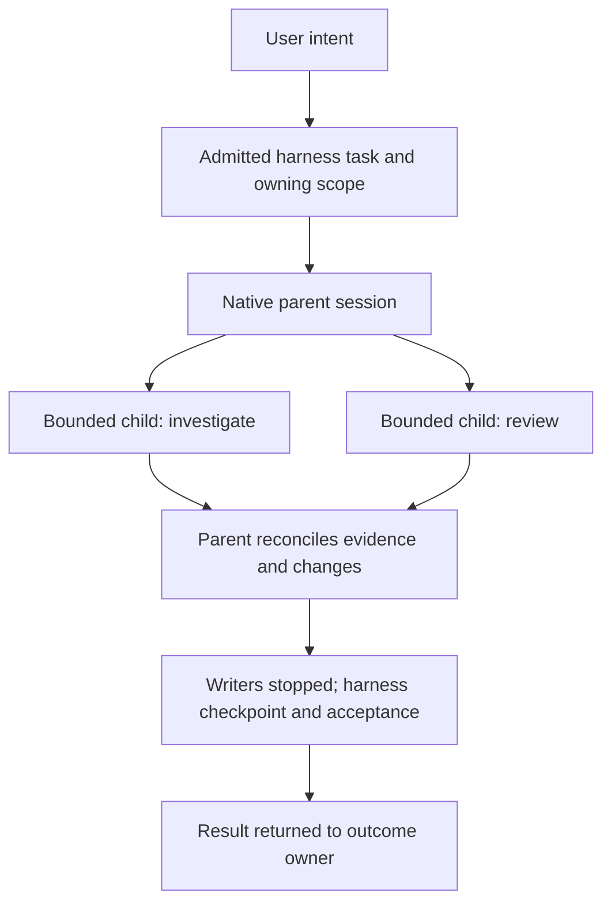

# Native session alignment

> Historical native-runtime investigation and operator decisions. The [native runtime reference](native-provider-runtime.md) owns the current configuration and storage contract.

Operator correction, 2026-09-06. The intended interaction is a steward backed
by the native Codex/Claude session, including receiving input while it works.
Resuming a saved session ID alone does not establish that experience.

The operator has also agreed to reuse the native agent loop and put its memory
and session evidence in the Git world for cross-session and cross-agent reading.
Configuration isolation means giving the steward its own integrations, rather
than inheriting the operator's personal Gmail plugin. It does not require
disabling native configuration or memory as a product policy. The reuse map and
storage direction below carry these later clarifications. The optional
[native provider runtime](native-provider-runtime.md) now implements Codex App
Server execution/steering and stewardship-owned native configuration. Original
native records and memories now follow candidate checkpointing, and durable
source routing shares one active execution and accepted world receipt.
The sections below retain the investigation's historical observations; the
[runtime document](native-provider-runtime.md) and [handoff](handoff.md) describe
the current implementation and live evidence.

## What exists, and what was misrepresented

Both adapters already resume real provider sessions: Codex uses `exec resume`
and Claude uses `--resume`. Their context is not reconstructed solely from our
episodes, and they are not stateless calls. The earlier description of
"isolated calls" blurred persistent session identity and process lifetime.

Each invocation nevertheless accepts only an initial prompt. Codex's stdin is
closed after writing it; Claude receives `-p` with streamed output but no input
stream. The shared adapter exposes `execute(request) -> result` and `cancel`,
with no ongoing input or event interface. The busy-session repair prevents
message loss within this arrangement; it is not the desired interaction model.

## Boundaries to reconsider

| Concern | Inspected implementation | Direction of review |
| --- | --- | --- |
| Session identity | Conversation/task rows retain native provider IDs and provider-generation fences. | Preserve real native continuity; distinguish a session from the process connected to it. |
| Active interaction | One prompt in, one final result out; incoming messages wait in our inbox. | Deliver input through the provider's supported ongoing-session interface and preserve its steering/queue/interruption semantics. |
| Message correlation | A new source event creates a new harness turn; an active turn excludes another. | Several messages may belong to one active execution. Receipt of input, provider acceptance, and completed work are different facts. |
| Workspace and acceptance | Each ordinary turn checks out a world candidate, accepts its result, and discards the worktree. | Determine the workspace lifetime around native session activity; a new message need not create another writer or checkout. |
| Result return | A task receipt starts another ordinary assessment invocation. | Return evidence to the owning native session, including when it is already working, with truthful source attribution. |
| Native configuration | Codex uses `--ignore-user-config` and disables goals; Claude uses `--safe-mode`, restricted settings sources, and explicit tools. | Audit each suppression against the intended experience and actual authority boundary. Do not preserve it merely because it exists, or remove it without understanding its effects. |
| External authority | The controller owns grants, gates, exact-SHA publication, deployment and durable receipts. | Native session behavior must compose with these responsibilities; accepting conversational input does not grant another writer or publication authority. |

The useful distinction is **session, incoming message, active execution, and
accepted external effect**. They do not have a one-to-one relationship.

This is a direction for the replacement, not a claim that it is implemented.
A native session need not keep an operating-system process alive forever.
Connecting, steering, disconnecting, and resuming must follow the supported
provider lifecycle rather than an assumed process-per-message rule.

## Checkpoint cadence can stay

Operator clarification, 2026-09-06: saving a checkpoint at each tick/turn is
compatible with native session continuity. The session can perform a `/commit`
reflection, or the harness can invoke a lightweight Git commit reflection
between turns. Which side initiates that reflection is an implementation
detail; it does not require a new session or a process-per-message lifecycle.
`/commit` here names the intended workflow, not a verified built-in command
shared by both providers.

Keep three boundaries explicit:

- The session reasons about the saved work and proposes its commit subject and
  disposition. A separate reflection must receive the actual bounded work
  evidence; it must not become a second steward deciding the broader outcome.
- Checkpoint capture needs a stable tree and exclusive workspace mutation.
  An incoming message or scheduler tick alone does not prove that the native
  writer has stopped. A between-turn reflection runs once that writer is
  quiescent; an in-session reflection stays within the same writer ownership.
- The controller retains and records the exact checkpoint through the existing
  authority boundary. A model-created local commit is still candidate work;
  gates, publication, deployment, and durable acceptance remain controller-owned.

A no-diff turn can still record findings and disposition. A saved checkpoint
does not mean every received message was consumed or that the broader outcome
is complete. The live exercise below should include a checkpoint followed by
continued work in the same native session, without an unnecessary reconnect.

## Evidence before implementation

Codex App Server documents `turn/steer`, which adds input to an active turn
using an expected turn ID. Claude documents persistent streaming input with
queued messages and interruption. These are distinct semantics; one generic
"send means immediately consumed" promise would misrepresent them.
Sources: [Codex App Server](https://learn.chatgpt.com/docs/app-server#steer-an-active-turn),
[Claude streaming input](https://code.claude.com/docs/en/agent-sdk/streaming-vs-single-mode),
and [Claude CLI input/acknowledgement flags](https://code.claude.com/docs/en/cli-reference).
The interfaces have been inspected in documentation, not yet proven through a
live harness integration. The local preflight below also does not establish
successful model execution. Local inspected versions were Codex 0.153.4 and
Claude Code 2.1.220; downstream installed versions require their own inspection.

First exercise one real session per provider: begin bounded work, send a
correction while it is active, observe acceptance and application, receive its
result, and reconnect/resume. Include input racing completion or disconnection
so we know what evidence supports recovery without claiming exactly-once
delivery from an acknowledgement alone. Preserve the existing authority policy
during that experiment. Then derive the smallest adapter and state changes
from those observations and identify which current mechanisms can disappear.

Do not expand the existing queue/turn machinery as the architectural answer
before this exercise. No replacement schema, session manager, or deployment
change is selected by this note.

## Local preflight, 2026-09-06

The follow-up inspected the same installed versions and the adapter launch
arguments, then exercised the entry points without changing runtime code,
provider configuration, credentials, or downstream state.

| Check | Observed result | Consequence |
| --- | --- | --- |
| Codex `app-server generate-json-schema` | Generated local protocol schemas. `TurnSteerParams` requires `threadId`, `expectedTurnId`, and `input`; it also exposes optional `clientUserMessageId`. | Use the installed protocol when building the exercise. The presence of a client message ID does not prove deduplication. |
| Codex `app-server --ignore-user-config --stdio` | Exits 2 with `unexpected argument '--ignore-user-config'`. | The existing `exec` launch cannot be copied directly. Establish equivalent configuration isolation before starting an authenticated session; do not silently load the operator's full configuration. |
| Claude streaming-input preflight | In a temporary directory, with existing safe-mode/settings restrictions, no tools, and a USD 0.10 cap: emitted `system/init`, echoed `user`, emitted `assistant`, then `result` with `subtype: success`, **`is_error: true`**, and `Not logged in · Please run /login`; process exited 1. | Streaming input was parsed and echoed, but no successful model turn was established. A result subtype or input echo alone cannot serve as completion evidence. |

The Claude check used `-p --input-format stream-json --output-format stream-json
--verbose --replay-user-messages`, sent one JSON user message, and closed stdin.
It was a launch/authentication preflight, not the persistent-input experiment.
It was repeated once to extract the error result without publishing session or
authentication payloads. No active correction, checkpoint, interruption, or
reconnect was tested. Authentication must be available to the execution identity
before the Claude exercise can proceed; controller credentials are not a substitute.

**Later diagnosis:** the local Claude account was logged in. Sandboxed keychain
access and missing `USER`/`LOGNAME` in the filtered probe environment made it
appear logged out. A read-only check outside the sandbox isolated the latter:
adding only those account-name variables restored login discovery. The local
broker now derives both names from its effective OS identity, as the configured
split-identity path already did; inherited names cannot impersonate another
account. Focused execution-boundary and lifecycle tests: 32 passed, 1 skipped.
This repairs local authentication discovery, not streaming-session integration.

## Configuration audit to carry into the exercise

The current controls have different purposes. Inspect them individually rather
than treating the whole launch policy as either necessary or disposable.

| Existing control | Inspected effect or purpose | Question to settle |
| --- | --- | --- |
| Codex `--ignore-user-config` | Explicit on `exec`; rejected by the local App Server entry point. Operator says its purpose was avoiding personal integrations such as Gmail on the VPS. | Use a steward-owned configuration home with the steward's integrations. Prove that personal configuration is absent; reproducing this exact flag is unnecessary. |
| Codex `--disable goals` | Explicit feature suppression in the adapter. | Does it still serve an agreed execution bound, or unnecessarily suppress intended native behavior? No removal selected. |
| Claude `--safe-mode` | Local help says it disables CLAUDE.md, skills, plugins, hooks, MCP servers, custom commands/agents, and other customizations; built-in tools and permissions still work. | Which native instructions and workflows should be restored under the execution boundary? A custom `/commit` cannot simply be assumed available under this launch. |
| Claude empty setting sources and strict MCP configuration | Explicit restrictions on configuration and MCP loading. | Which sources and integrations are authorised for the steward identity? Restoring one does not imply restoring all. |
| Claude auto-memory disabled | Adapter currently suppresses native memory because its default location is outside the Git world. | Operator selected native memory in the Git world. Redirect its storage and include its writes in checkpointing, then remove this suppression once verified. |
| Native sandboxes, tool permissions, broker environment and OS identity | Bound workspace mutation and separate model execution from controller authority. | Carry these through the experiment and any new transport; changing input semantics does not replace their enforcement. |

Current native source: [`codex_app_server.py`](../src/steward_harness/runtime/providers/codex_app_server.py),
[`claude.py`](../src/steward_harness/runtime/providers/claude.py), and
[`execution.py`](../src/steward_harness/runtime/execution.py). Current public
Claude CLI documentation also describes newer flags with version requirements;
those are not proof of support in the inspected 2.1.220 binary.

## Smallest useful live exercise

Run against a disposable Git workspace using the execution identity and approved
provider authentication. Keep stdin/transport open, bound runtime and spend,
record only synthetic work evidence, and terminate/reap the owned process on
every failure path. Do not connect to an unrelated existing user session.

1. Begin a session with bounded work whose output is easy to verify, such as
   writing a supplied marker to one file. Observe an active execution before
   injecting a correction; sending two initial messages is insufficient.
2. Send a different marker while work is active. Record source ID, provider
   session/turn identity, send time, acknowledgement or rejection, output
   events, and the resulting file. For Codex, use the observed expected turn
   ID; for Claude, distinguish queued input from interruption.
3. At a verified writer boundary, obtain a lightweight reflection and capture
   the checkpoint. Continue another bounded turn on the same session and
   workspace. Check both the saved SHA and continuity of the corrected marker.
4. Inject synthetic, explicitly attributed `harness:task-result` evidence while
   the session is active. Verify its assessment without representing it as an
   operator instruction or a new authority grant.
5. Send input after completion, and separately disconnect after sending but
   before observing acknowledgement. Reconnect/resume and inspect available
   native history before deciding whether to resend. Retain an unresolved
   delivery when evidence cannot distinguish acceptance from loss.
6. Interrupt bounded work and observe the provider's terminal state and process
   cleanup before releasing writer ownership. Inspect retained partial work;
   an interruption request alone is insufficient proof that mutation stopped.

For each case report **passed**, **failed**, or **not exercised**, with the
actual event sequence and file/SHA evidence. Neither provider has passed this
matrix yet. Only after those observations should the adapter contract and
durable correlation changes be selected. In particular, do not add another
queue, persistent session manager, or schema merely to host the experiment.

### Live progress after the preflight

The [reproducible probes](../experiments/native_sessions/README.md) now exercise
real Codex and Claude-Code-through-GLM sessions. Codex passed active steering,
late-steer rejection, a Git checkpoint, continuation on the same connection,
and explicit resume with native records mapped into the world. GLM passed
active correction, continuation/resume, native memory and session recording in
the world directory, and a fresh session reading the shared memory.

The GLM path works with native sandbox enforcement and `acceptEdits`; it does
not require `--dangerously-skip-permissions`. Its initially tested safe-mode
launch was then replaced with an isolated configuration home, approved settings,
and enabled native memory. The underlying native loop remains intact.

This is evidence for thin transport/path mapping. It does not yet prove the
full matrix: ambiguous delivery, native interruption, background writer capture,
and controller acceptance still need exercise and integration. The existing
runtime remains on its one-input adapter contract. The local identity fix's
full regression suite passed: **553 passed, 1 skipped** (178.60 seconds).

The next interruption probe passed through GLM, including an observed stopped
shell and continuation on the same session. Codex twice reported an interrupted
turn while its shell remained live in a separate process group. This narrows the
middleware boundary: native cognition state and writer quiescence are distinct
facts. Preserve writer ownership until there is evidence for the latter; do not
turn a provider interrupt acknowledgement into checkpoint permission. Details
and the reproducible failing assertion are in the probe README.

### First shared runtime increment

`ProcessController.run()` now offers bounded ongoing stdin through
`on_input_ready(ProcessInput)`. The same broker still launches the process and
owns cancellation, deadlines, stream limits, and cleanup. Pending input is capped
at 1 MiB; writes are nonblocking, EOF follows queued bytes, and a retained input
handle rejects writes after execution ends. This also fixes the old initial
prompt write blocking before cancellation/deadline observation when a child
does not read stdin.

The live probes now use this shared primitive. Codex continuity/checkpoint/resume
and GLM native interruption passed again through it. Regression coverage includes
input following output, ordered EOF, unread-pipe cancellation and timeout,
initial-prompt timeout, callback failure cleanup, and the pre-launch size limit.
Full suite: **559 passed, 1 skipped** (183.48 seconds).

The full GLM memory journey then passed through the same broker: active input,
reflection, native records and memory in the world, Git checkpoint, continuation,
explicit resume, and a fresh session using the shared memory. File assertions
verified each artifact rather than treating provider prose as completion proof.

This is transport plumbing, not durable message delivery. `write()` means bytes
entered a bounded local buffer; only native events can establish further facts.
Production cognition still exposes the existing one-input contract. The Codex
writer-lifetime issue above remains unresolved by this change.

The next Codex probe sent a uniquely identified steering input, observed its
local byte buffer drain, and disconnected before processing an acknowledgement.
Explicit resume worked, but native history lacked the input marker. The source
receipt must remain unresolved: a drained pipe does not prove native acceptance,
and absent history does not prove rejection. Native session resume therefore
cannot replace durable source receipts or authorize blind resubmission. This
fixture exercises lost acknowledgement processing, not a network partition;
the provider may have emitted an acknowledgement before teardown.

The integration must keep these evidence boundaries distinct:

| Observed evidence | What the controller may conclude | What remains pending |
| --- | --- | --- |
| Input queued locally, or pipe drained | A local transport operation happened. | Native acceptance and source completion. |
| Correlated native acknowledgement or input echo | The provider observed the identified input with that interface's semantics. | Inclusion in an accepted world result; an echo alone does not prove steering or completion. |
| Identified input recovered in native history | There is native recording evidence for that input. | The result and its controller acceptance; replay safety still needs proof. |
| Input absent after native resume | Recovery has not found acceptance evidence. | Delivery remains unresolved; do not automatically resubmit. |
| Native terminal event | The provider reports a terminal cognition state. | Any remaining writer lifetime and the ordinary Git-world acceptance boundary. |
| Existing world acceptance finalized | The source has a durable accepted result. | Only the existing reply/outbox delivery, if still pending. |

This does not call for a second inbox or transcript database. Extend the
existing source-owned records only with the correlation and evidence needed
to cross these boundaries. Keep native provider/session/turn identifiers tied
to the existing session generation so reconnecting or switching provider cannot
accidentally attribute an old acknowledgement to new work.

## Reuse first: native functionality, mapping, and engineering

Operator question, 2026-09-06: what can an agnostic middleware reuse directly
from the native harnesses, what needs lightweight mapping, and what requires
actual engineering? The following is the proposed division of responsibility,
not a selected replacement API or a claim of completed integration. Reusing the
native loop and making native memory/session evidence readable in the Git world
are agreed directions; the remaining transport and storage mechanics need proof.

**Reuse the native agent loop as a unit.** Steward should attach to that loop
and supply authorised work, input, and evidence. It should not recreate the
provider's reasoning/tool cycle behind a series of model calls. Provider
neutrality belongs at the boundary with Steward; native implementations and
capabilities can remain different underneath it.

| Concern | Reuse from the native harness | Lightweight mapping | Engineering Steward still owns |
| --- | --- | --- | --- |
| Reasoning, tools, context | Native execution loop, tool dispatch, and context management. | Approved model/profile, working directory, instructions, and tool policy. | Enforce the execution identity and grants; do not build another tool loop. |
| Conversation continuity | Native history and explicit session resumption. | Associate an owner and provider generation with the native session ID. | Recover that association and handle missing sessions or provider switches truthfully. Much of this already exists. |
| Shared memory and session evidence | Native memory writing and session recording. | Route those artifacts into the Git world and provide a discoverable path/index for other sessions. | Capture consistent revisions, coordinate background writers, and verify completeness and restart. Use native files before considering any replacement memory store. |
| Input during work | Codex active-turn steering; Claude streaming input and supported interruption. | Translate an explicit input intent and report the actual provider disposition. | Correlate durable source receipt, provider evidence, and recovery when delivery is uncertain. |
| Progress and results | Native output, tool, and terminal events. | Small common event vocabulary with provider IDs and details retained. | Decide when work is durably accepted and when its receipt may be delivered. |
| Instructions and workflows | Native instruction/skill/command loading where supported and enabled. | Install or select approved stewardship instructions and a commit-reflection workflow. | Audit configuration authority. Avoid implementing a second skill runner or assuming every interactive slash command is an API operation. |
| Questions and permissions | Native question and approval mechanisms where exposed. | Route a request and its response to the right owner with its native request ID. | Check current grants, request lifetime, and revoked/stale responses. Tool approval does not grant publication authority. |
| Checkpoint reflection | The native session can inspect work and propose a subject/disposition; the existing cheap wrap-up can do the same. | Trigger the workflow and parse its bounded result. | Establish a stable tree, retain exact Git objects, and record acceptance. Existing checkpoint/acceptance code supplies most of this. |
| Task-result return | The owning native session can reason about supplied evidence. | Deliver a source-labelled result through the same input path as other session inputs. | Preserve ownership, result revision, replay, and dependent-action acceptance. No separate assessment agent is inherently needed. |
| Delegated cognition | Use native subagent facilities where the adapter exposes and policy permits them. | Describe bounded work and translate its returned evidence. | Cross-provider dispatch, retained repository tasks, common allowance, and recovery remain separate requirements; a native child is not automatically a durable Steward task. |
| Rhythms and durable knowledge | Native cognition and context compaction can perform their native functions. | Supply a light/sleep/REM reflection as an ordinary authorised invocation. | Existing durable schedules, host wake, and Git-world consolidation persist. Context compaction is not acceptance of durable world knowledge. |
| Cancellation and retry | Supported native interruption and internal execution recovery. | Map interrupt requests and observed terminal states. | Stop/reap remaining writers, retain partial work, and reconcile external effects before any retry. A transport reconnect must not blindly repeat the task. |
| Usage and limits | Provider-reported usage and native per-execution controls where available. | Preserve units and unknown values; translate supported limits. | A shared allowance across providers, tasks, and retries requires accounting and enforcement; telemetry alone does not provide it. |
| Publication and deployment | Existing Steward Git/gate/deployment implementation. | Accept a typed proposal from either provider. | Keep exact-SHA publication, credentials, rollback, and reconciliation in the controller. These are already engineering assets to reuse. |

The native basis is documented in [Codex App Server](https://learn.chatgpt.com/docs/app-server)
and the [Claude Agent SDK overview](https://code.claude.com/docs/en/agent-sdk/overview).
Claude's [session documentation](https://code.claude.com/docs/en/agent-sdk/sessions)
also explicitly separates saved conversation from saved files. Availability in
documentation does not establish that the current launch flags expose a feature;
the configuration audit and local preflight above remain applicable.

### Keep the middleware small and honest

Start by exercising connect/resume, submit input, observe events, interrupt,
and disconnect through supported provider transports. Prefer the provider's
maintained client where it covers these needs and can run under the broker;
write transport glue only where it does not. In particular, evaluate Claude's
Python `ClaudeSDKClient` before hand-writing its bidirectional control protocol.
SDK adoption must preserve subprocess identity/environment enforcement, rather
than moving model tools into the credentialed controller process.

Expose capabilities rather than promising false equivalence. For example,
an operator correction can request active steering. If the provider can only
queue it, report that disposition or use a separately permitted interruption
policy. Do not label the result "steered" just because bytes were written.
Normalise the few facts Steward needs, while retaining the native IDs and
provider-specific failure evidence. An unknown event is not automatically a
failure, but an unknown terminal state cannot be treated as successful work.

Use existing durable inbox/outbox records for receipt and retry ownership.
They remain useful even when input no longer waits for a new invocation.
Native in-process queues do not themselves prove crash-safe delivery from
Telegram, desk, or task results. Conversely, storing another complete native
transcript in SQLite is unnecessary unless a concrete recovery need demands it.
Git episodes continue to serve durable stewardship knowledge, not native
context reconstruction on every exchange. Their present role should be reviewed
against the native records; do not maintain a duplicate transcript just to keep
the current episode pipeline intact.

### What could become simpler

- Replace the one-prompt/one-final-result adapter restriction with a connection
  to native interaction, without replacing the kernel's publication machinery.
- Remove busy-session deferral **as a mandatory interaction rule** where the
  provider accepts ongoing input. Keep durable ingress and ownership fencing.
- Feed task evidence into the owning session without requiring a fresh
  assessment invocation for every result; keep result acceptance and replay.
- Reuse one workspace through connected activity rather than checking out a
  second writer for each incoming message. Workspace lifetime, coordination
  with rhythms, and the checkpoint boundary need an explicit recovery proof.
- Express commit reflection as approved workflow content or the existing
  lightweight wrap-up. Its location is a small choice; durable capture is the
  real boundary. Today `WorktreeCheckpointer.stage()` collapses model-created
  history to one attributed checkpoint, so preserving native commits unchanged
  would be a separate policy change, not a prerequisite for native sessions.

Do not delete the existing fallbacks until the corresponding live scenario
passes. Native delegation also does not automatically change D04's agreed
decomposition policy. The first useful implementation should prove ongoing
input and a checkpoint on the same session while reusing existing acceptance.
That evidence will show whether further engineering is needed; the feature
inventory alone is not a reason to build a general session platform.

## User intent, native tasks, and subagent fanout

Reflection requested by the operator, 2026-09-06. The harness task represents
an admitted commitment toward the user's intended outcome: scope, authority,
retained work, acceptance conditions, and delivery back to its owner. An outcome
may require several harness tasks. Native plans, task lists, tool jobs, and
subagents describe how the provider works on the current assignment. Their
completion is evidence for the owner to assess; it does not complete the user's
commitment by itself.

For example, “make sign-in reliable” might produce native subtasks to reproduce
a failure, inspect token handling, implement a fix, and review tests. These
need not become four durable harness tasks. Keep them native unless a piece
needs an independently owned scope, admission, lifecycle, or deliverable. A
native task ID is useful correlation, not a replacement for the harness task
ID; one harness task may span multiple native turns and session generations.

Native fanout fits this boundary. Codex documents parallel child threads and
parent aggregation; Claude exposes delegation through its Agent tool and
parent-tool correlation. Reuse that orchestration rather than scheduling every
child through the kernel. Native capabilities are documented, but fanout has
not yet been exercised by these broker-backed probes. Sources:
[Codex subagents](https://learn.chatgpt.com/docs/agent-configuration/subagents)
and [Claude SDK subagents](https://code.claude.com/docs/en/agent-sdk/subagents).

The intended flow is:

Parallel cognition is compatible with one harness task owner and serial
publication. Concurrent mutation needs a concrete arrangement: read-only
children can share the checkout; writers need disjoint ownership or isolated
worktrees and explicit integration. A native worktree alone does not integrate
its changes into the harness candidate. Children must stay within the owning
scope's credentials and resources. Reading another world's memory supplies
context, not permission to change that world or publish its repositories.

The parent must account for outstanding children before checkpoint, clear,
shutdown, or completion. A final parent message is insufficient if a child can
still write. Cancellation covers descendants as well as the parent; our Codex
shell-lifetime failure makes this a measured integration requirement. Late
child results must remain attributed to their original task/session generation,
and a partial or failed child result must not silently become success.

D04 currently permits the steward's direct bounded delegation and prohibits
delegated executions from spawning further executions. Native implementation
does not erase that policy. First-level fanout from the owning steward fits;
a repository worker spawning its own helpers requires an explicit revision of
D04. The operator has asked us to examine this direction; this reflection does
not claim unlimited recursive delegation is already agreed or implemented.

The next proof should use two bounded native children, record actual spawn and
result correlation, and verify parent aggregation without new harness task
rows. Then exercise one failed child and one still-running writer at parent
termination. Verify credential scope, stop propagation, and checkpoint capture
before enabling production fanout. Keep cross-provider fanout separate: a
provider's native child facility does not establish a Claude-to-Codex dispatcher.

### First Codex fanout exercise

On 2026-09-06, the broker-backed Codex probe added a disposable
`--fanout-only` exercise. Its private provider home contains two explicit,
read-only custom children (`child_alpha` and `child_beta`) and permits two
concurrent spawned threads. The parent was directly instructed to spawn both,
wait, aggregate their fixed tokens, and write the one parent-owned artifact.
No harness task rows, publication credentials, or non-fixture paths were
involved.

**Corrected evidence:** the initial probe confused child completion with parent
completion: its helper accepted the first `turn/completed` on the multiplexed
connection without checking `threadId` or `turn.id`. The earlier assertion that
Codex finished the parent before its children is withdrawn. After matching both
identities, Codex 0.153.4 passed two-child completion, parent aggregation, and
checkpoint `9504e5855144d9db22c68589b45ac8bfd233aef2`. Three deterministic tests
protect this correlation, including buffered events and failed children.

Operator clarification: the two read-only, fixed-token children are a narrow
instrumentation fixture. The desired native workflow includes searching, tools,
and collaborative writes in the owning scope. Their method should emerge in
the native session. Scope/credentials and exact Git acceptance remain the
controller boundary. The read-only fixture establishes no production child
count or tool restriction. Descendant cancellation and background writers
remain separate questions; this corrected happy path does not answer them.

## Steward configuration and native storage in the Git world

The desired setup is one steward-owned provider environment, with its approved
plugins, native agent loop, and native memory/session records accessible in its
Git world. Other authorised agents can read those records with ordinary file
tools to understand ongoing work. Native formats can remain native: cross-agent
readability does not require one provider to resume another provider's session.

Documented configuration gives us concrete starting points:

| Provider | Direct configuration | Small mapping to verify |
| --- | --- | --- |
| Codex | `CODEX_HOME` selects its configuration/state root; native memories live beneath that root. | Provision a steward-owned home and place its memory/session artifacts in the world, using supported paths or a tested filesystem mapping. Verify full session records and resume metadata, rather than assuming `history.jsonl` alone is complete. |
| Claude | `CLAUDE_CONFIG_DIR` relocates settings, session history, and plugins; `autoMemoryDirectory` selects the memory directory directly. | Point memory at the world and map the native session directory there. Verify path-derived project identity across retained workspaces and resume. |

Sources: [Codex configuration/state locations](https://learn.chatgpt.com/docs/config-file/config-advanced#config-and-state-locations),
[Codex native memories](https://learn.chatgpt.com/docs/customization/memories?surface=app),
[Claude configuration locations](https://code.claude.com/docs/en/settings), and
[Claude memory location](https://code.claude.com/docs/en/memory#storage-location).
The local probes above verify the session-directory mappings for both installed
binaries and Claude's explicit memory directory. Codex automatic memory
generation and restoration from Git without private runtime databases remain
unproven. Do not depend on newer Claude project-directory flags without checking
the installed version.

Keep provider authentication, sockets, locks, caches, and live databases in
runtime storage; map the memory/session artifacts intended for reading and Git
history. A provider home can contain authentication as well as history, so
versioning the entire home is not the proposed mapping. Prefer direct native
writes into the appropriate world paths. Use an export only if native storage
cannot be safely mapped, and make its capture position visible rather than
presenting an old export as live activity.

A small directory convention by steward/provider/session, plus an orientation
link, may be enough for discovery. Avoid a search service, replacement memory
schema, or transcript normalisation layer until ordinary files demonstrate a
specific limitation. Readability means agents can inspect the available records;
it does not mean every record is automatically loaded into every context.

The storage exercise must prove a native memory write, a complete recorded
exchange, reading both from a second authorised session, and resuming after
restart from the same mapped storage. Also check an active append and any
background memory update during checkpointing. Native memory generation can
happen after a turn, so end-of-turn quiescence alone is insufficient proof that
all world writers have stopped. This is concrete writer/capture engineering,
not a reason to replace the native memory machinery.

Keep source attribution and record freshness visible. Session records show what
an agent observed or attempted; accepted controller receipts show what actually
landed. With those facts preserved, the Git world can hold the shared account
without making another memory system the owner of it.
